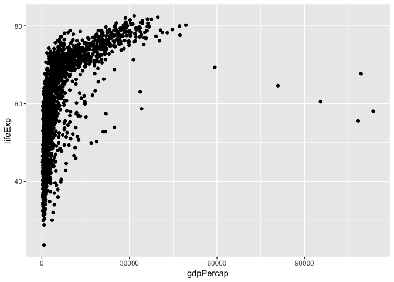

*This is some formatting*

**Some other formatting**

[A hyperlink](https://google.com)

- A bulleted list
- Another list item

1. A numbered list
1. A second numbered item.


```
## # A tibble: 6 x 6
##   country     continent  year lifeExp      pop gdpPercap
##   <fct>       <fct>     <int>   <dbl>    <int>     <dbl>
## 1 Afghanistan Asia       1952    28.8  8425333      779.
## 2 Afghanistan Asia       1957    30.3  9240934      821.
## 3 Afghanistan Asia       1962    32.0 10267083      853.
## 4 Afghanistan Asia       1967    34.0 11537966      836.
## 5 Afghanistan Asia       1972    36.1 13079460      740.
## 6 Afghanistan Asia       1977    38.4 14880372      786.
```


<!-- -->

<!-- -->


<!-- -->

<!-- -->

<!-- -->

The largest population of any country in this dataset is 1318683096.


The maximum life expectancy in Iceland is 81.757.

```
(base) L145458:rr-workshop shsu$
(base) L145458:rr-workshop shsu$ git config --list
credential.helper=osxkeychain
(base) L145458:rr-workshop shsu$ git config --global user.name "Doo Young Kim"(base) L145458:rr-workshop shsu$ git config --global user.email "dkim@shsu.edu"
(base) L145458:rr-workshop shsu$ git config --global core.editor "nano"
(base) L145458:rr-workshop shsu$ git config --list
credential.helper=osxkeychain
user.name=Doo Young Kim
user.email=dkim@shsu.edu
core.editor=nano
(base) L145458:rr-workshop shsu$ git init
Initialized empty Git repository in /Users/shsu/Desktop/rr-workshop/.git/
(base) L145458:rr-workshop shsu$ git remote add origin https://github.com/dkim-shsu/rr-workshop.git
(base) L145458:rr-workshop shsu$ git push -u origin master
error: cannot run rpostback-askpass: No such file or directory
Username for 'https://github.com': dkim-shsu
error: cannot run rpostback-askpass: No such file or directory
Password for 'https://dkim-shsu@github.com':
Enumerating objects: 18, done.
Counting objects: 100% (18/18), done.
Delta compression using up to 12 threads
Compressing objects: 100% (17/17), done.
Writing objects: 100% (18/18), 2.57 MiB | 6.23 MiB/s, done.
Total 18 (delta 3), reused 0 (delta 0)
remote: Resolving deltas: 100% (3/3), done.
To https://github.com/dkim-shsu/rr-workshop.git
 * [new branch]      master -> master
Branch 'master' set up to track remote branch 'master' from 'origin'.
(base) L145458:rr-workshop shsu$
```

Here is some more text that I am adding.

One final line of text.


## R Markdown

This is an R Markdown document. Markdown is a simple formatting syntax for authoring HTML, PDF, and MS Word documents. For more details on using R Markdown see <http://rmarkdown.rstudio.com>.

When you click the **Knit** button a document will be generated that includes both content as well as the output of any embedded R code chunks within the document. You can embed an R code chunk like this:


```r
summary(cars)
```

```
##      speed           dist       
##  Min.   : 4.0   Min.   :  2.00  
##  1st Qu.:12.0   1st Qu.: 26.00  
##  Median :15.0   Median : 36.00  
##  Mean   :15.4   Mean   : 42.98  
##  3rd Qu.:19.0   3rd Qu.: 56.00  
##  Max.   :25.0   Max.   :120.00
```

## Including Plots

You can also embed plots, for example:

<!-- -->

Note that the `echo = FALSE` parameter was added to the code chunk to prevent printing of the R code that generated the plot.
